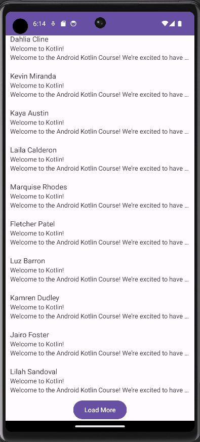

# Android Lab 2 - CopaMail

Submitted by: Sawwon Lee

CopaMail is an android app that imitiates GMail.

Time spent: 1 hour spent in total

## Required Features

The following **required** functionality is completed:

* [X] Add a RecyclerView to the layout
* [X] Add the Email and EmailFetcher classes to your app
* [X] Create the layout for each item
* [X] Create the RecyclerView.Adapter to bridge the data and the layout
* [X] Bind the adapter to the RecyclerView
* [X] Improve the RecyclerView item layout 

The following **optional** features are implemented:

* [X] Add a 'Load More' button to display the next 5 emails
* [ ] More layout improvements

## Video Walkthrough

Here's a walkthrough of implemented features:

GIF created with [ScreenToGif](https://www.screentogif.com/) for Windows

## Notes

Describe any challenges encountered while building the app.

## License

    Copyright 2023 Sawwon Lee

    Licensed under the Apache License, Version 2.0 (the "License");
    you may not use this file except in compliance with the License.
    You may obtain a copy of the License at

        http://www.apache.org/licenses/LICENSE-2.0

    Unless required by applicable law or agreed to in writing, software
    distributed under the License is distributed on an "AS IS" BASIS,
    WITHOUT WARRANTIES OR CONDITIONS OF ANY KIND, either express or implied.
    See the License for the specific language governing permissions and
    limitations under the License.
